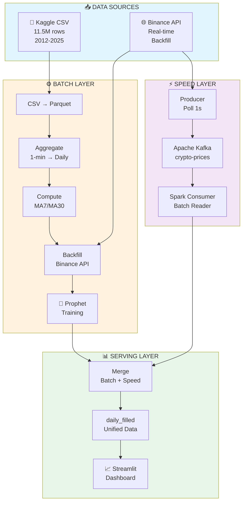
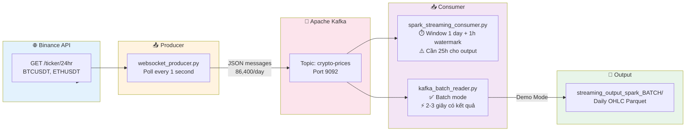
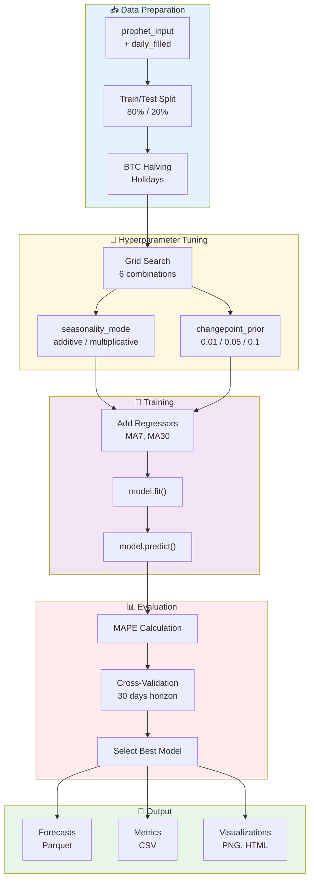
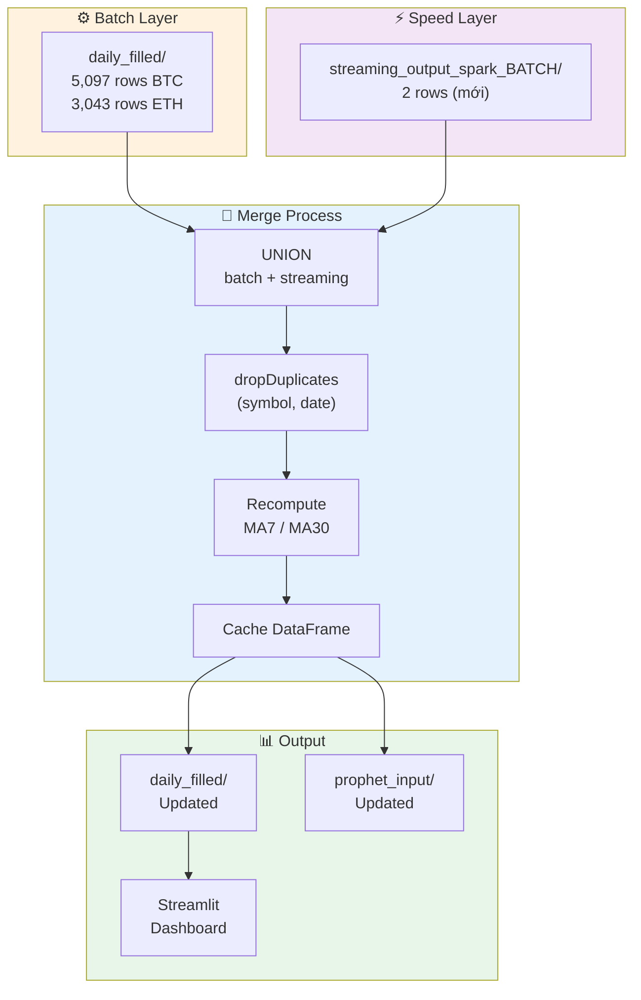
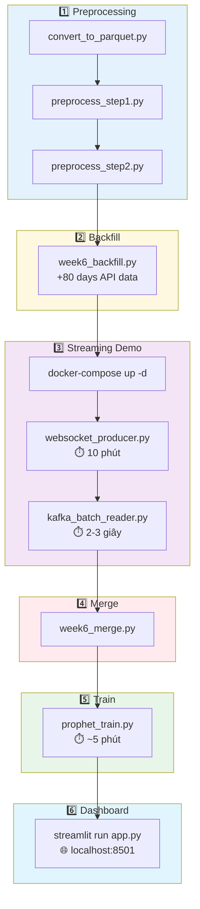
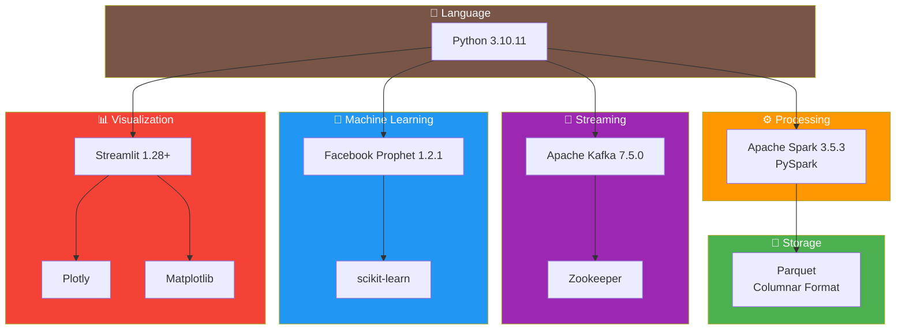
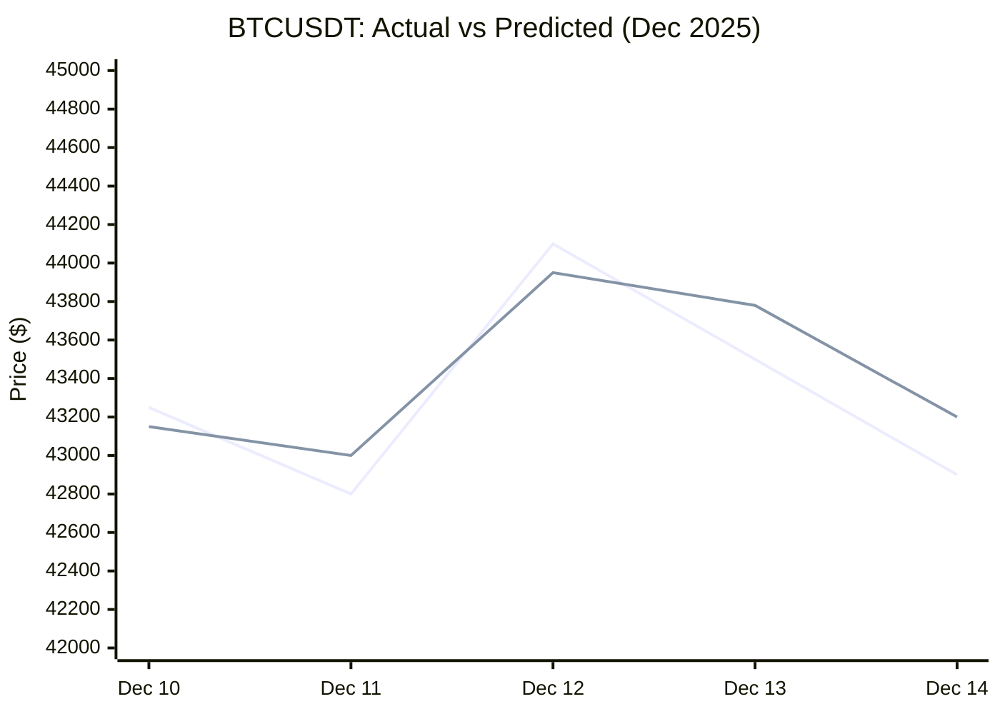

# 📊 MÃ MERMAID CHO BÁO CÁO

File này chứa các mã Mermaid để vẽ sơ đồ cho báo cáo. Bạn có thể copy và paste vào [Mermaid Live Editor](https://mermaid.live/) để vẽ, sau đó export ra PNG/SVG.

---

## 1. SƠ ĐỒ KIẾN TRÚC LAMBDA ARCHITECTURE (Phần Mở đầu / Phần 1.1)

**Vị trí chèn:** Sau dòng "Kiến trúc Lambda Architecture:" trong phần Mở đầu



---

## 2. SƠ ĐỒ DATA PIPELINE (Phần 2.4 hoặc Phần 3.1)

**Vị trí chèn:** Sau phần "Khối lượng dữ liệu" hoặc đầu Phần 3

```mermaid
flowchart LR
    subgraph INPUT["📥 Input"]
        CSV["CSV Files<br/>557 MB<br/>11.5M rows"]
    end

    subgraph PREPROCESSING["⚙️ Preprocessing"]
        P1["convert_to_parquet.py<br/>→ Parquet 335MB"]
        P2["preprocess_step1.py<br/>→ daily_raw 7,980 rows"]
        P3["preprocess_step2.py<br/>→ daily_filled + MA"]
    end

    subgraph BATCH["📦 Batch Layer"]
        BF["week6_backfill.py<br/>+80 days from API"]
        MG["week6_merge.py<br/>Merge batch+streaming"]
    end

    subgraph ML["🔮 Machine Learning"]
        PT["prophet_train.py<br/>Grid Search + CV"]
        FC["Forecasts<br/>MAPE 2.38%"]
    end

    subgraph OUTPUT["📊 Output"]
        DASH["Streamlit<br/>Dashboard"]
    end

    CSV --> P1 --> P2 --> P3 --> BF --> MG --> PT --> FC --> DASH

    style INPUT fill:#ffebee
    style PREPROCESSING fill:#e3f2fd
    style BATCH fill:#fff8e1
    style ML fill:#f3e5f5
    style OUTPUT fill:#e8f5e9
```



---

## 3. SƠ ĐỒ SPEED LAYER / STREAMING (Phần 3.2)

**Vị trí chèn:** Đầu phần 3.2 "Thu thập và xử lý dữ liệu thời gian thực"



---

## 4. SƠ ĐỒ PROPHET TRAINING PROCESS (Phần 3.1.3)

**Vị trí chèn:** Đầu phần 3.1.3 "Xây dựng mô hình Prophet"



---

## 5. SƠ ĐỒ SERVING LAYER / MERGE (Phần 3.2.4)

**Vị trí chèn:** Đầu phần 3.2.4 "Merge Batch Layer và Speed Layer"



---

## 6. SƠ ĐỒ DEMO WORKFLOW (Phần 4.3.2)

**Vị trí chèn:** Thay thế hoặc bổ sung cho phần "Quy trình chạy Demo"



---

## 7. SƠ ĐỒ TECHNOLOGY STACK (Phần 4.1)

**Vị trí chèn:** Sau bảng "Lựa chọn công cụ"



---

## 8. SƠ ĐỒ KQUA - ACTUAL VS PREDICTED (Phần 4.4)

**Vị trí chèn:** Phần kết quả minh họa (nếu cần)



---

## 📝 HƯỚNG DẪN SỬ DỤNG

1. Copy mã Mermaid (phần trong ```mermaid ... ```)
2. Truy cập [Mermaid Live Editor](https://mermaid.live/)
3. Paste code vào editor
4. Điều chỉnh màu sắc/layout nếu cần
5. Export ra PNG hoặc SVG
6. Chèn hình vào báo cáo Word

**Lưu ý:** Một số diagram phức tạp có thể cần chỉnh sửa thêm trong editor để đẹp hơn.
